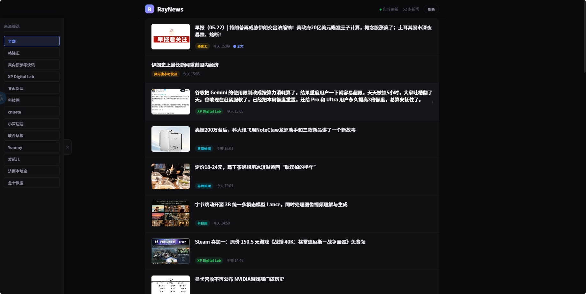

<p align="center">
  <a href="README.md">🇨🇳 中文</a> | <b>🇺🇸 English</b>
</p>

# RayNews 📡

A news aggregator that fetches messages from a Telegram channel (powered by [RSS-to-Telegram-Bot](https://github.com/Rongronggg9/RSS-to-Telegram-Bot)), automatically extracts Telegraph full articles, and serves a dark-mode news site.



## Architecture

```
News Sources (RSS/Web/API)
          ↓
 RSS-to-Telegram-Bot ──push──→ Telegram Channel (t.me/s/your_channel)
                                      ↓
                        RayNews Fetcher ──poll──→ news.json
                                      ↓
                              Nginx + Vue 3 SPA Frontend
```

**Data flow:**

1. **[RSS-to-Telegram-Bot](https://github.com/Rongronggg9/RSS-to-Telegram-Bot)** — subscribes to RSS feeds and pushes new articles to your Telegram channel
2. **Telegram Channel** — acts as intermediate storage; RayNews fetches messages from the channel's public page (`t.me/s/channel_name`)
3. **RayNews Fetcher** — Python script, incrementally fetches new messages every 15 minutes, auto-detects sources, extracts Telegraph full text
4. **Frontend** — Pure Vue 3 SPA, dark theme, source filtering, article details, sharing

> **Note:** RayNews only **reads** from Telegram. You'll need another tool (like [RSS-to-Telegram-Bot](https://github.com/Rongronggg9/RSS-to-Telegram-Bot)) or manual posting to push content into the channel.

## Prerequisites

- A public Telegram channel
- (Optional) [RSS-to-Telegram-Bot](https://github.com/Rongronggg9/RSS-to-Telegram-Bot) or other tools to push news to your channel

## Quick Start

### 1. Clone

```bash
git clone https://github.com/rayyume/RayNews.git
cd RayNews
```

### 2. Configure

```bash
# Copy environment template
cp .env.example .env

# Edit .env with your Telegram channel name and other settings
```

### 3. Start

```bash
docker compose up -d
```

The fetcher runs once on startup, then every 15 minutes via cron.

### 4. Access

- Frontend: `http://<your-ip>:8090`
- Manual refresh: `http://<your-ip>:8090/refresh`
- Data API: `http://<your-ip>:8090/news.json`

## Environment Variables

| Variable | Default | Description |
|----------|---------|-------------|
| `TELEGRAM_CHANNEL` | `your_channel` | Telegram channel name (required) |
| `TZ` | `Asia/Shanghai` | Container timezone, affects log timestamps |
| `DATA_DIR` | `/app/data` | Data output directory (container path) |
| `HTTP_PROXY` | (empty) | HTTP proxy |
| `HTTPS_PROXY` | (empty) | HTTPS proxy |
| `NO_PROXY` | `localhost,127.0.0.1` | Direct connection whitelist |

## Custom Build

```bash
# Build locally
docker compose build

# Or pull pre-built image from ghcr.io
docker compose pull
```

## Roadmap 🗺️

### Short-term

- [x] **Source Categorization** — Group and filter articles by source/tags
- [x] **WeChat Official Account Articles** — Identify and extract full-text content from WeChat public accounts
- [ ] **Auto-translate English Content** — Automatically translate English titles and articles (e.g. into Chinese)
- [ ] **Key-words filter** — Hide articles containing specific words

### Long-term

- [ ] **Custom AI API** — Bring your own AI API for article summaries and daily digests
- [ ] **TTS News Reading** — Text-to-speech for listening to news
- [ ] **iOS App** — Native iOS client

## Tech Stack

- Python 3.12 (fetcher + refresh server)
- Nginx (static file serving)
- Vue 3 (frontend, pure static SPA)
- BeautifulSoup (HTML parsing)
- Supervisor (process management)

## License

MIT
